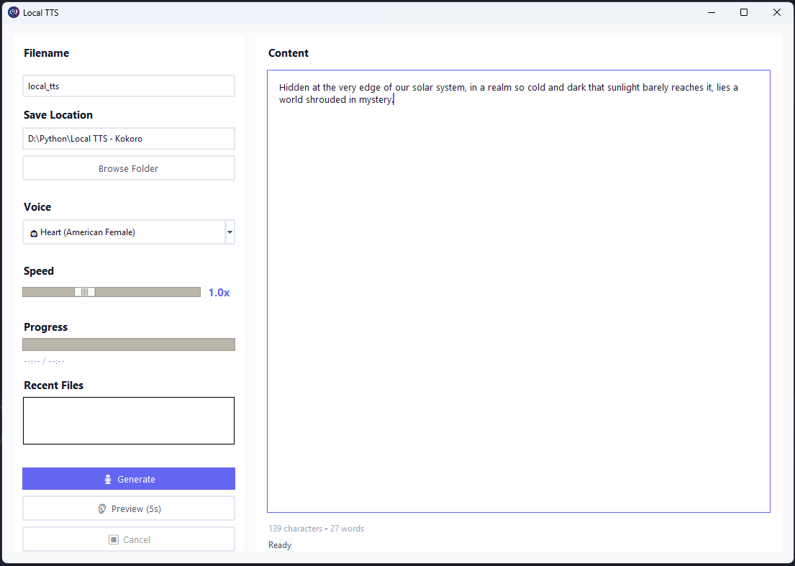

# Local TTS - Kokoro

A powerful, locally-run Text-to-Speech (TTS) application built with the **Kokoro TTS engine**. This desktop application provides a modern GUI for generating natural-sounding speech in multiple languages and accents without requiring cloud services.



## Features

✨ **Multi-Language Support**

- American English, British English, Indian English, and more
- Chinese (Mandarin), French, German, Italian, Japanese, Spanish, and Polish
- 50+ diverse voice options including multiple speakers per language

🎙️ **Diverse Voice Library**

- Gender-specific voices (male/female indicators)
- Multiple accents and personality traits per language
- Native speaker quality for each supported language

🔧 **Advanced Controls**

- Adjustable speech rate and pitch
- Real-time text input with live preview
- Batch processing for multiple sentences
- Audio export in WAV format

💻 **User-Friendly Interface**

- Modern desktop GUI built with Tkinter
- Light/Dark theme support
- Keyboard shortcuts (Ctrl+Enter to generate, Esc to cancel)
- Progress tracking and real-time generation status

🚀 **Performance Optimized**

- GPU acceleration support (CUDA/Metal)
- Lazy device initialization for fast startup
- Per-language pipeline caching
- Multi-threaded audio generation

## Installation

### ⚡ Quick Start (Automated)

**Windows:**

- Double-click `install.bat`
- Wait 5-10 minutes
- Double-click `run_app.bat`

**macOS/Linux:**

```bash
chmod +x install.sh && ./install.sh
source .venv/bin/activate
python app.py
```

### Manual Setup

**Requirements:** Python 3.10+ | 2GB disk | 500MB download

**Windows:**

```bash
python -m venv .venv
.venv\Scripts\activate
python -m pip install torch==2.1.2 torchaudio==2.1.2 torchvision==0.16.2 --index-url https://download.pytorch.org/whl/cpu
python -m pip install -r requirements.txt
python app.py
```

**macOS/Linux:**

```bash
python3 -m venv .venv
source .venv/bin/activate
python -m pip install torch==2.1.2 torchaudio==2.1.2 torchvision==0.16.2
python -m pip install -r requirements.txt
python app.py
```

## Usage

### Basic Text-to-Speech Generation

1. **Select a Voice**: Choose from the dropdown menu. Voices are grouped by language and labeled with gender indicators (👩 for female, 👨 for male).

2. **Enter Text**: Type or paste the text you want to convert to speech in the input area.

3. **Adjust Settings**:

   - **Speech Rate**: Control how fast the speech is generated (0.5 - 2.0x)
   - **Pitch**: Adjust voice pitch characteristics

4. **Generate**: Click the "Generate" button or press Ctrl+Enter

5. **Listen & Export**: Play the audio preview and save as WAV file

### Keyboard Shortcuts

- **Ctrl+Enter**: Start generation
- **Esc**: Cancel ongoing generation
- **Ctrl+O**: Open file dialog to save audio

### Output Formats

Generated audio files are saved as **WAV format** at 24kHz sample rate for optimal quality.

## Supported Languages & Voices

### American English (af*, am*)

11 female voices: Alloy, Aoede, Bella, Heart, Jessica, Kore, Nicole, Nova, River, Sarah, Sky
10 male voices: Adam, Echo, Eric, Fenrir, Liam, Michael, Onyx, Puck, Santa

### British English (bf*, bm*)

4 female voices: Alice, Emma, Isabella, Lily
4 male voices: Daniel, Fable, George, Lewis

### Additional Languages

- **Indian English**: ef_dora, em_alex, em_santa
- **French**: ff_siwis
- **German**: hf_alpha, hf_beta, hm_omega, hm_psi
- **Italian**: if_sara, im_nicola
- **Japanese**: jf_alpha, jf_gongitsune, jf_nezumi, jf_tebukuro, jm_kumo
- **Portuguese**: pf_dora, pm_alex, pm_santa
- **Chinese (Mandarin)**: zf_xiaobei, zf_xiaoni, zf_xiaoxiao, zf_xiaoyi

## Requirements

See `requirements.txt` for the complete dependency list. Key dependencies include:

- **Kokoro**: Core TTS engine
- **PyTorch**: Deep learning framework with GPU support
- **Tkinter**: GUI framework
- **SoundFile**: Audio file I/O
- **NumPy**: Numerical computing
- **spaCy**: NLP for text processing
- **TTS ecosystem**: espeak-ng, g2p-en, and other speech synthesis tools

## Architecture

- **`app.py`**: Main application with GUI and TTS pipeline management
- **`assets/`**: Application resources (icon, images)
- **`kokoro`**: TTS engine and voice synthesis models

The application uses:

- Thread-based audio generation to keep the GUI responsive
- Queue-based communication between generation and UI threads
- Lazy device (GPU/CPU) initialization for startup performance
- Pipeline caching to avoid reloading models when switching voices

## Performance Tips

- **First Generation**: May take longer as models are loaded into VRAM
- **GPU Acceleration**: Ensure CUDA/Metal is properly installed for ~3-5x speedup
- **Batch Processing**: Generate multiple sentences at once for efficiency
- **Memory**: Close other applications to maximize available VRAM for larger models

## Troubleshooting

### Models not found

Ensure model files are properly installed with the Kokoro package. The application will attempt to download them automatically on first run.

### Slow generation

- Check if GPU acceleration is enabled: look for CUDA/Metal in the generation log
- Close unnecessary applications to free up memory
- Consider reducing speech rate for faster processing

### Audio quality issues

- Ensure you're using a supported voice for your language
- Try adjusting pitch and rate settings
- Regenerate with the same settings to ensure consistency

### Installation issues

If you encounter pip errors during installation:

```bash
pip install --upgrade pip setuptools wheel
pip install -r requirements.txt
```

## License & Credits

Built with the **Kokoro TTS** engine - a state-of-the-art multilingual text-to-speech synthesis system.

This application is provided as-is. Please refer to the licenses of individual dependencies for usage rights.

## Contributing

Contributions are welcome! Feel free to:

- Report bugs and issues
- Suggest new features
- Improve documentation
- Optimize performance

## Support

For issues specific to Kokoro TTS, visit the [Kokoro GitHub repository](https://github.com/hexgrad/kokoro).

---

**Note**: This is a local-only application. All processing happens on your machine - no data is sent to external services.
